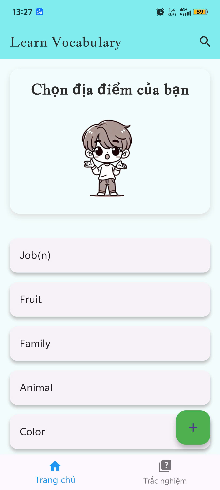
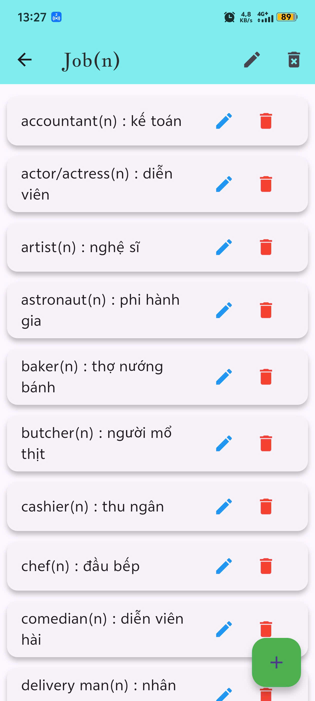
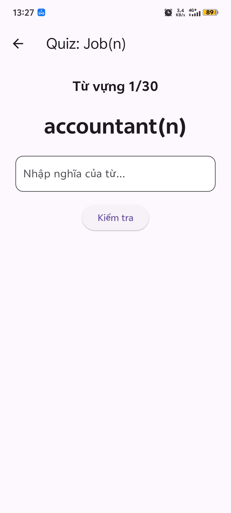

Đây là một ứng dụng học tiếng Anh cá nhân phát triển bằng Flutter, với phương pháp học mới mẻ – "khoanh vùng khu vực". Người dùng có thể tạo các khu vực như phòng khách, nhà bếp, phòng ngủ,..., và thêm vào các từ vựng tương ứng với các vật dụng trong từng khu vực. Ví dụ:
Khu vực: Phòng ngủ
-> Từ vựng: bed: cái giường, pillow: cái gối...
Ứng dụng còn cung cấp chế độ trắc nghiệm theo khu vực, giúp người học ôn tập và ghi nhớ từ vựng hiệu quả hơn.
    Công nghệ sử dụng:
- Flutter (UI framework đa nền tảng)
- Firebase Firestore (Cơ sở dữ liệu cloud realtime)
- MVVM Architecture (Model - View - ViewModel)
- Provider (Quản lý trạng thái)
- SharedPreferences (Lưu cấu hình người dùng cơ bản)
  Tính năng chính:
- Tạo và quản lý khu vực học tập (ví dụ: Nhà bếp, Phòng khách, ...)
- Thêm, sửa, xóa các từ vựng trong từng khu vực
- Hiển thị danh sách từ vựng theo từng khu vực
- Chế độ trắc nghiệm (Quiz) giúp luyện tập từ vựng theo từng khu vực
- Không cần đăng nhập, dữ liệu được lưu và đồng bộ tự động qua Firebase

## Danh mục ảnh

  
  
  

